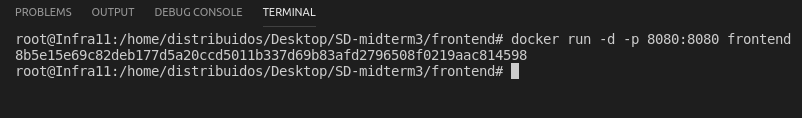
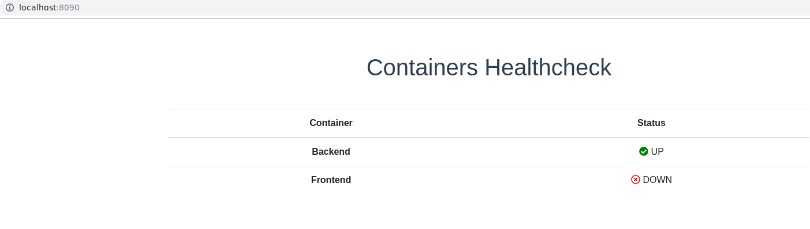

# Tercer parcial de Sistemas Distribuidos 2019-2

## Integrantes
- Sandra Mishale Niño Arbeláez- A00022220
- Daniel Quintero Correa - A00021588

## 1. Documentación del procedimiento para el despliegue de los contenedores

La aplicación está dividida de la siguiente manera backend (realizado en NodeJs), frontend(realizado en VueJs) y un healthcheck (realizado en VueJs), por ende, existirán 3 contenedores. 

Como se mencionó, se usó NodeJs para realizar el backend de la aplicación. Para ello, se requirió instalar las siguientes dependencias:
- body-parser
- dotenv
- express
- mongodb
- cors: Esta fue de gran importancia para evitar los errores relacionados a cors cuando se accediera desde el frontend. 

A continuación, se presenta el Dockerfile del backend, el cual nos permitirá crear una imagen para el contenedor que se va a crear. 

En orden vemos: 
1. Se utiliza una imagen base del docker-hub de Node, en este caso node:12.2.2.0-alpine
2. El directorio app será nuestro directorio actual
3. Se copian los archivos de package.json y package-lock.json en dicho directorio. Esto es porque estos archivos contienen las dependencias de la aplicación. 
4. Se corre el comando **npm install**, el cual instala las dependencias del proyecto.
5. Se copian los archivos del proyecto al directorio actual (app)
6. Se expone por el puerto 4000
7. Se ejecuta el comando **node index.js**, el cual permite levantar el backend.

Ahora que tenemos el Dockerfile generado, realizaremos los siguientes comandos:

1. `cd backend` : Este comando es para ubicarnos en el directorio de backend, donde reside la aplicación y el archivo Dockerfile
2. `sudo docker build -t <imagename> .` : Este comando crea una imagen a partir del Dockerfile

`sudo docker images`: Lista las imágenes presentes en la máquina 

3. `sudo docker run -d -p <hostport>:<containerport> <imagename>`: Este comando crea un contenedor a partir de una imagen y queda el contenedor corriendo. 

`sudo docker ps -a`: Lista los contenedores presentes en la máquina (activos y no activos)

Ahora podemos ingresar en nuestro navegador a http://localhost:4000 para evidenciar que el contenedor está corriendo.

4. En caso tal de que se desee parar el contenedor, se puede ejecutar el comando `docker stop <containerID>`

5. En caso tal de que se haya parado el contenedor y se quiera volver a correr, se puede ejecutar el comando `docker start <containerID>`

Como se mencionó, se usó VueJs para realizar el frontend de la aplicación. Para ello, se requirió instalar las siguientes dependencias:
- axios: Permite realizar los llamados HTTP al API del backend
- core-js
- vue

Cabe resaltar que se modificó el archivo de configuración de vue (**vue.config.js**) para evitar el error de CORS cuando se intentará acceder desde el healthcheck.

A continuación, se presenta el Dockerfile del frontend, el cual nos permitirá crear una imagen para el contenedor que se va a crear. 

En orden vemos: 
1. Se utiliza una imagen base del docker-hub de node, en este caso node:12.2.2.0-alpine
2. El directorio app será nuestro directorio actual
3. Se copian los archivos de package.json y package-lock.json en dicho directorio. Esto es porque estos archivos contienen las dependencias de la aplicación. 
4. Se corre el comando **npm install**, el cual instala las dependencias del proyecto.
5. Se copian los archivos del proyecto al directorio actual (app)
6. Se expone por el puerto 8080
7. Se ejecuta el comando **npm run serve**, el cual permite levantar el frontend.

Ahora que tenemos el Dockerfile generado, realizaremos los siguientes comandos:
1. `cd frontend`: Este comando es para ubicarnos en el directorio de frontend, donde reside la aplicación y el archivo Dockerfile
2. `sudo docker build -t <imagename> .` : Este comando crea una imagen a partir del Dockerfile

`sudo docker images`: Lista las imágenes presentes en la máquina 

3. `sudo docker run -d -p <hostport>:<containerport>  <imagename>` : Este comando crea un contenedor a partir de una imagen y queda el contenedor corriendo. 

`sudo docker ps -a`: Lista los contenedores presentes en la máquina (activos y no activos)

Ahora podemos ingresar en nuestro navegador a http://localhost:8080  para evidenciar que el contenedor está corriendo. 

En la imagen vemos campos para crear un nuevo usuario y una lista de usuarios agregados previamente. Ahora procederemos a crear un nuevo usuario:

Después al darle click al botón “Add new register”, vemos el mensaje exitoso y en la lista vemos el usuario creado correctamente. 

Como se mencionó, se usó VueJs para realizar el frontend del healthcheck de los contenedores. Para ello, se requirió instalar las siguientes dependencias:
- axios: Permite realizar los llamados HTTP
- core-js 
- vue

Cabe resaltar que se modificó el archivo de configuración de vue (vue.config.js) para modificar el puerto donde se expondría el healthcheck.

A continuación, se presenta el Dockerfile del healthcheck, el cual nos permitirá crear una imagen para el contenedor que se va a crear. 

En orden vemos: 
1. Se utiliza una imagen base del docker-hub de node, en este caso node:12.2.2.0-alpine
2. El directorio app será nuestro directorio actual
3. Se copian los archivos de package.json y package-lock.json en dicho directorio. Esto es porque estos archivos contienen las dependencias de la aplicación. 
4. Se corre el comando **npm install**, el cual instala las dependencias del proyecto.
5. Se copian los archivos del proyecto al directorio actual (app)
6. Se expone por el puerto 8090
7. Se ejecuta el comando **npm run serve**, el cual permite levantar el healthcheck. 

Ahora que tenemos el Dockerfile generado, realizaremos los siguientes comandos:

1. `cd healthcheck`: Este comando es para ubicarnos en el directorio de healthcheck, donde reside la aplicación y el archivo Dockerfile
2. `sudo docker build -t <imagename> .` : Este comando crea una imagen a partir del Dockerfile

`sudo docker images`: Lista las imágenes presentes en la máquina 

3. `sudo docker run -d -p <hostport>:<containerport>  <imagename>` : Este comando crea un contenedor a partir de una imagen y queda el contenedor corriendo. 

`sudo docker ps -a`: Lista los contenedores presentes en la máquina (activos y no activos)

Ahora podemos ingresar en nuestro navegador a http://localhost:8090  para evidenciar que el contenedor está corriendo.

En la imagen anterior, vemos que ambos contenedores (frontend y backend) están corriendo. Ahora procederemos a bajar un contenedor con el comando `docker stop <containerID>`

Ahora procederemos a bajar el otro contenedor

## 2. Archivos fuente
LLos archivos fuente se encuentran en el repositorio. Los archivos de mayor interés son los Dockerfile para el frontend, backend y healthcheck, los cuales están ubicados en las carpetas con el mismo nombre. El archivo de docker-compose.yml, que está ubicado en el root del proyecto. Tal vez interese revisar los archivos de configuración de vue (vue.config.js) que están cada uno en el frontend y healthcheck. 

## 3. Documentación de las tareas para desplegar la aplicación

Como ejecutamos los comandos anteriores, hay containers que están activos (up), para realizar la orquestación y probar que ésta construya las imágenes necesarias y despliegue los contenedores, se hace necesario parar todos los contenedores, después removerlos y después remover las imágenes.

Primero detenemos la ejecución de los contenedores existentes:

1. `sudo docker stop $(sudo docker ps -a -q)`:  para parar todos los contenedores

Después removemos los contenedores existentes:

2. `sudo docker rm $(sudo docker ps -a -q)`: para borrar todos los contenedores

Después removemos las imágenes existentes:

3. `sudo docker rmi $(sudo docker images -q)`: para borrar todas las imágenes

Ahora procederemos a configurar un archivo docker-compose.yml en la carpeta raíz del proyecto:
 

En este archivo se especifica el nombre los servicios, que nombre va a tener cada contenedor, en el build se especifica dónde está ubicado el Dockerfile que va a permitir construir las imágenes. En volumes se especifica que se monten las carpetas de node_modules y app de cada servicio en el docker host. Y en ports se especifica `<hostport>:<dockerhost>` , osea el puerto de nuestra máquina local por dónde está expuesto ese servicio y en que puerto de docker se va a exponer.

Después se procede a ejecutar el orquestador con el comando:
`docker-compose up -d`
 

Una vez finalizado se comprueba que se hayan construido las imágenes necesarias:
 

También se comprueba que se hayan creado los contenedores y estos estén activos:
 

Comprobamos nuestro healthcheck, que debe dar como resultado que los 2 servicios están arriba:
 

Para comprobar que todo está funcionando correctamente, hacemos un insert de un nuevo usuario:
 

Y comprobamos que se inserte:
 

También podemos probar nuevamente, bajar un contenedor con el comando `docker stop <containerID>`

Ahora procederemos a bajar el otro contenedor

## 4. Problemas encontrados y acciones efectuadas
Los problemas encontrados y las acciones efectuadas fueron las siguientes:

1. Al realizar los primeros Dockerfile para el backend y frontend,la primera vez que se intentó hacer build de la imagen de frontend, no lograba encontrar algunos archivos de configuración, y era porque no se había considerado la línea  **COPY . .*

2. Al realizar la orquestación con el docker compose, salía un error de que no encontraba ciertos archivos, en la línea de código de los volumes de cada contenedor. 
Por ejemplo, en la del backend, se tenía la línea de código de la siguiente manera:

`volumes:
      - './:/app'
      - '/app/node_modules'`
      
Se cambió a esta forma:
`volumes:
      - './backend/:/app'      
      - '/app/node_modules'`
      
Y así con la del frontend y el healthcheck.

3. Al hacer docker build y docker run para el contenedor del healthcheck, salía un error de que el puerto se trocaba con el del frontend. Por ende, se cambió el archivo de configuración del healthcheck, como se muestra en el punto 1, para exponer esa aplicación por otro puerto diferente al 8080. 

4. Al hacer los llamados desde el frontend al backend(API), salía un error de CORS, por ende, se instaló la dependencia  cors (**npm install cors --save**) y se llamó en el archivo index.js del back. 

5. Al hacer los llamados desde el healthcheck al frontend, salía un error de CORS, por ende, se cambió el archivo de configuración del frontend, como se muestra en el punto 1, para permitir el acceso desde otro origen. 

## Bibliografía

Dockerize Vuejs: https://vuejs.org/v2/cookbook/dockerize-vuejs-app.html

Docker hub: https://hub.docker.com/_/node

Dockerize Nodejs: https://codewithhugo.com/node-postgres-express-docker-compose/

Vue-cli: https://cli.vuejs.org/config/#devserver
